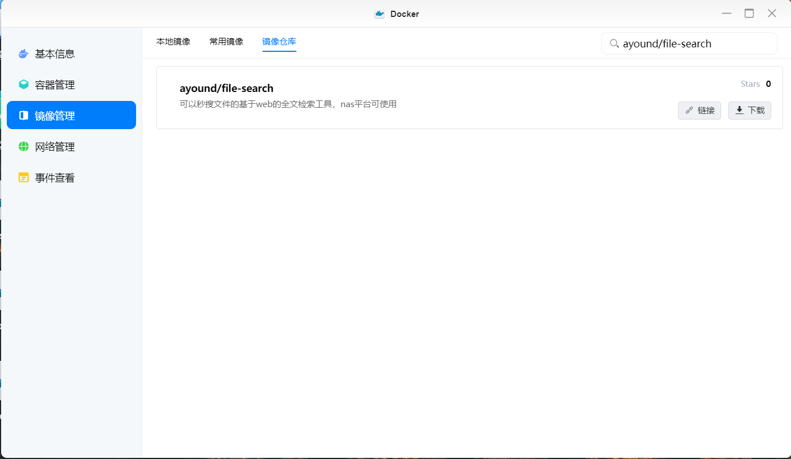
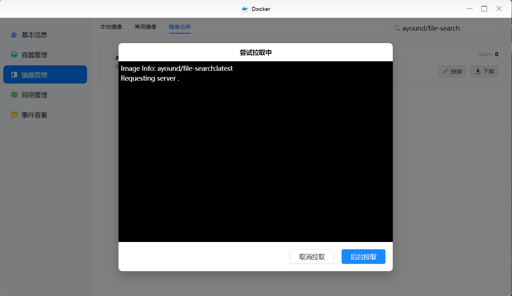
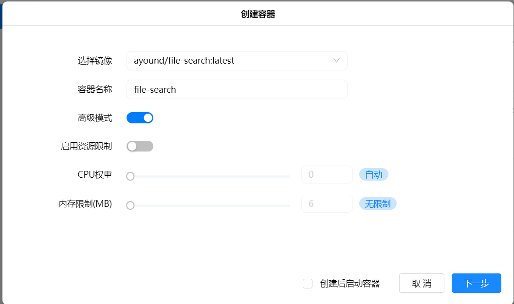
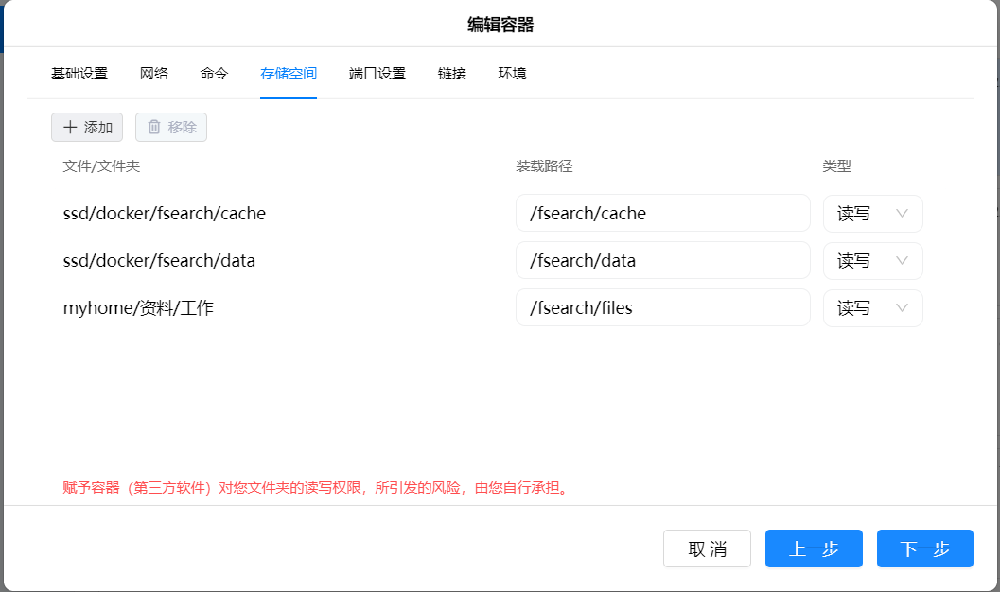
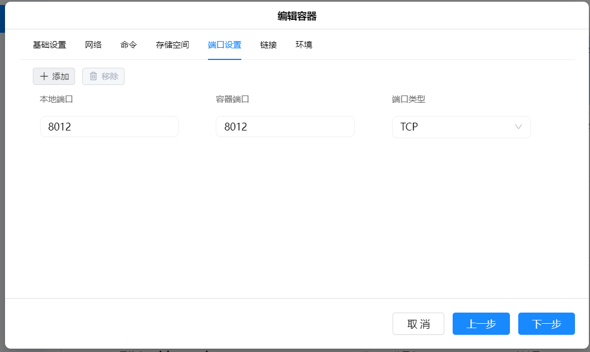
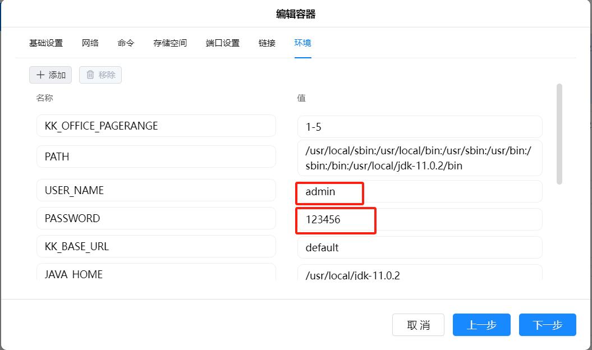
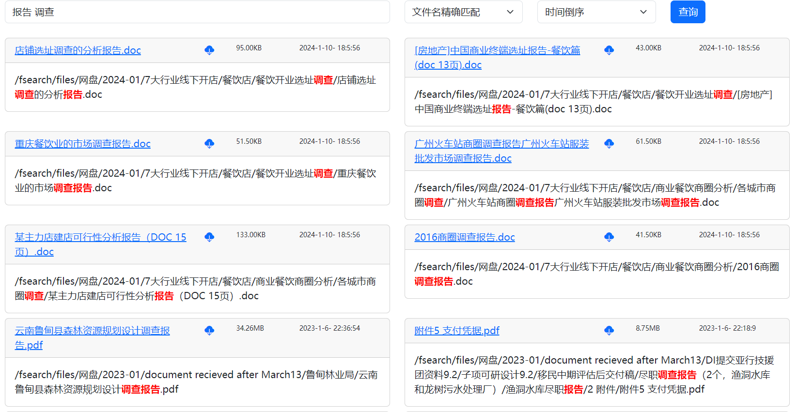
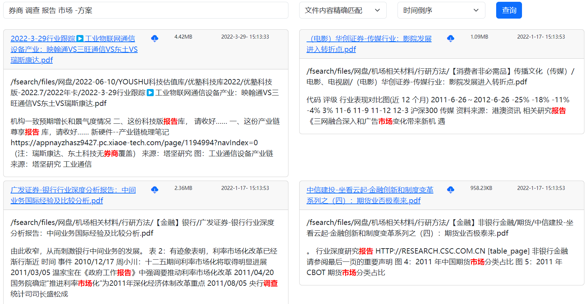
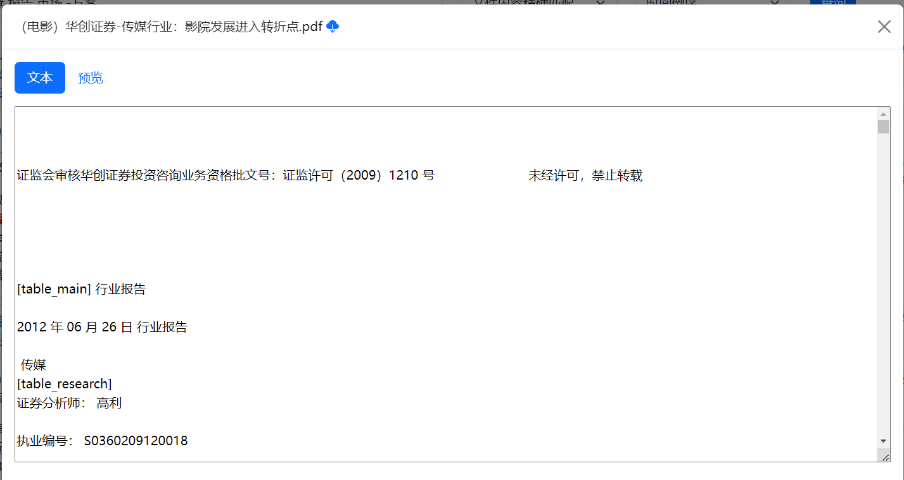

---

---

# 绿联NAS操作系统docker安装方法

我自己使用的是绿联的NAS，里面放了几个T的文档，一直没找到好的全文检索工具，试过的全文检索工具在文档数量到几万的时候，基本上全文检索就打不开了，要么就是需要装3到5个docker镜像才能使用，因为NAS的资源有限，所以我就自己编写了一款文档的全文检索和预览工具。绿联的文档预览使用了WPS的服务，预览时要把文档发到WPS的云服务器上，对我来说，公网的云服务器是不可靠的，预览也必须是NAS提供的服务，因此才会有做这个文档搜索和预览工具的想法。主要有几个特点：

1.速度快，十万份文档的全文检索基本上是秒搜（在绿联4600 pro上可以做到）。

2.界面简单，程序除了登录只有一个界面，就是查询和预览文档。

3.本地预览，使用了KKFilePreview，可以做到本地预览。

4.完全开源，基于apache协议，可自行修改，开源地址：[GitHub - ayoundzw/file-search: 文件全文检索工具](https://github.com/ayoundzw/file-search)

因为是只花了几天时间手搓了一个程序，请不要吐槽代码质量问题，如有问题，请自行fork修改

本文详细介绍安装方法。

## 第一步：安装Docker镜像

在绿联的docker镜像管理/镜像仓库中搜索ayound/file-search，可看到搜索到的镜像如下：




点击下载按钮，打开下载镜像界面，因网速不同，可能下载时间不同，请耐心等待。




打开容器管理界面，点击创建容器按钮，选择刚才下载的镜像ayound/file-search:latest，点击下一步。



基本设置、网络和命令请保持原样，在存储空间请按照下图配置。

存储空间说明：

| 文件/文件夹                                  | 装载路径           | 类型      |
| --------------------------------------- | -------------- | ------- |
| 请选择缓存文件预览图片和PDF文件的文件夹，建议用SSD中的某个目录      | /fsearch/cache | 必须配置为读写 |
| 请选择保存文档搜索的索引数据的文件夹，为了保证高性能，建议用SSD中的某个目录 | /fsearch/data  | 必须配置为读写 |
| 请选择需要检索的文档文件夹                           | /fsearch/files | 必须配置为读写 |




端口设置：容器只开放一个端口，就是8012端口，请根据情况配置映射的本地端口，端口类型选择TCP。



环境配置：

请务必修改环境配置中的USER_NAME和PASSWORD，USER_NAME 默认为admin，登录的用户名，这个系统非常简单，只支持单用户登录，是基于spring security的默认登录做的，如有需要有更高级的功能，如多用户之类的功能，请自行下载源代码修改。

PASSWORD 默认为123456，登录的密码，必须修改。

点击下一步，完成容器创建工作，然后请启动容器。





容器的访问地址是http://[ip]:[port]/fsearch，如[http://localhost:8012/fsearch]

**注意：必须加/fsearch**，我这里为了方便nginx的二级目录代理，加了个目录/fsearch，如果想修改，请自行下载源代码修改

进入登录界面后，请输入刚才在环境配置中配置的账号密码，默认值为admin/123456


第一次打开时是空白的，程序会自动开始建索引，如果程序没有自动开始，请手动点击一下那个小三角开始创建索引。


目前做了4种查询方式：

1.根据文件名（含路径）精确匹配，支持空格，如 输入【数据 治理 上海】会把文件名中包含这三个词的文件查出来。也支持减号，如输入【数据 治理 -上海】，会查询数据和治理，去掉匹配上海的路径。

2.根据文件名（含路径）智能匹配，采用分词方式，可以输入一句话，软件自动中文分词，根据分词查询文件名。

3.根据文件内容精确匹配，支持空格，如输入【数据 治理 上海】会把文件内容中包含这三个词的文件查出来，注意：这里的分词是常用的分词，如果要用词曲，请自己开发

4.根据文件内容智能匹配，采用分词方式，可以输入一句话，软件自动中文分词，根据分词查询文件内容。






点击文件名可查看文件文本信息以及预览文件

1.超过200M的文档不支持预览，文档太大，预览太慢，不如下载下来本地打开

2.预览时只转换了前5页，这个也可以配置，可以配置一个ENV变量：KK_OFFICE_PAGERANGE来控制，默认值是1-5，改为false则全转换，不过不建议改，性能太差。




## Nginx代理

如果通过代理访问时，kkfilepreview获取文件地址会出错，需要加一个头X-Forwarded-For，示例如下：


```nginx
location /fsearch/ {
      proxy_pass http://[ip]:8012/fsearch/;#替换为自己的IP
      proxy_redirect off;
      proxy_set_header Host [host];#替换为自己的Host，如域名 
      proxy_set_header X-Real-IP $remote_addr;
      proxy_set_header X-Base-Url $scheme://$host/fsearch;#这句是关键，kkfilepreview根据这个找路径，配置不对的话无法预览
      proxy_set_header X-Forwarded-For $proxy_add_x_forwarded_for; 
}

```
